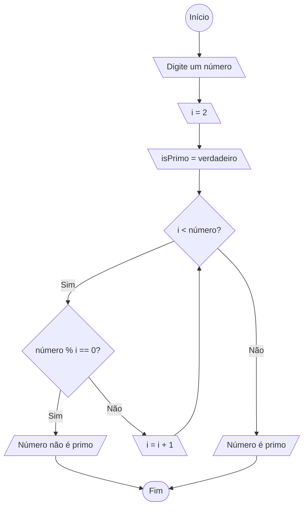

# Lista de Exercícios 01: Fluxogramas

Profº.: Cainã Antunes Silva  
Faculdade de Tecnologia **SENAI Sorocaba**  
Tecnólogo em Análise e Desenvolvimento de Sistemas (ADS)
___


> O objetivo desta aula é exercitar o raciocínio lógico para a criação de algoritmos através de fluxogramas.  

O fluxo de um algorítmo poder ser representado graficamente através de fluxogramas. Um conjunto de símbolos, representam cada ação realizada pelo programa, além disso, setas conectam estes símbolos uns com os outros indicando a sequencia em que as ações são executadas.

Para mais informações acesse [Aula 01: Fluxogramas.](https://www.notion.so/cainaantunes/Aula-01-Fluxogramas-188bde521b3b80de90f7dbd9407af71e)

***

1. Crie o fluxograma de um programa que solicita que o usuário digite sua nota e em seguida o programa exibe se o aluno foi “Aprovado” ou “Reprovado”. Leve em consideração que a nota deve estar entre 0 e 100 e que a condição para aprovação é ter uma nota igual ou superior à 50.
   
    ```mermaid
   
    flowchart TD
        start(( Início )) --> input[\ Digite sua Nota \]
        input --> verification{ Nota >= 50? }
        verification --> |Sim| A[/ Aprovado /]
        verification --> |Não| B[/ Reprovado /]
        A --> finish([ Fim ])
        B --> finish
    ```
   
2. Altere o exemplo anterior, acrescentando as seguintes condições: para ser o aprovado, o aluno precisa
ter nota igual ou superior à 50 e frequência igual ou superior a 75%.
   
   ```mermaid
   flowchart TD
      start((Inicio))-->input1[\Digite sua Nota entre 0 a 100\]
      input1-->input2[/Digite sua frequencia em %/]
      input2-->verification{Nota >=50 \n E\n Frequencia >=75%?}
      verification--> |Sim| A[/Aprovado/]
      verification-->|Não| B[/Reprovado/]
      A-->finish([Fim])
      B-->finish
   ```
   
3. Crie um fluxograma para calcular a soma de dois números fornecidos pelo usuário.
   
   ```mermaid
   flowchart TD
      start((Início))--> input1[\Digite o primeiro número\]
      input1-->input2[\Digite o segundo número\]
      input2-->operacao[ Resultado=N1+N2 ]
      operacao-->resultado[/resultado/]
      resultado-->final([Final])
   ```
   
4. Elabore um fluxograma que leia um número e exiba se ele é positivo ou negativo.
   
   ```mermaid
   flowchart TD
       start((Início))--> input1[\Digite o valor numérico\]
       input1 --> verification{ Número >= 0? }
       verification --> |Sim| A[/ Valor Positivo /]
       verification --> |Não| B[/ Valor Negativo /]
       A --> finish([ Fim ])
       B --> finish
   ```
   
5. Desenvolva um fluxograma que leia a idade de uma pessoa e indique se ela pode votar.
   
   ```mermaid
   flowchart TD
      start((Início))--> input1[\Digite a sua idade\]
   input1-->input2[\Possui Título de eleitor?\]
       input2 --> verification{ Idade >= 18 \n e \n com título? }
       verification --> |Sim| A[/ Pode votar /]
       verification --> |Não| B[/ Não pode votar /]
       A --> finish([ Fim ])
       B --> finish
   ```
   
6. Crie um fluxograma que leia dois números e determine o maior entre eles.
   
   ```mermaid
   flowchart TD
      start((Início))--> input1[\Digite o primeiro número\]
      input1-->input2[\Digite o segundo número\]
      input2-->igualidade{Número 1 = Número 2?}
   igualidade-->|Sim| A[/Os dois são iguais/]
   A-->finish[(Final)]
   igualidade-->|Não| maioridade{Número1 > Número2?}
   maioridade-->|Sim| B[/Número 1 é maior/]
   maioridade-->|Não| C[/Número 2 é maior/]
   B-->finish
   C-->finish
   ```
   
7. Crie um fluxograma que leia três números e determine o maior entre eles.
   
   ```mermaid
   flowchart TD
      start((Início))--> input1[\Digite o primeiro número\]
      input1-->input2[\Digite o segundo número\]
   input2-->input3[\Digite o Terceiro número\]
      input3-->igualdade1{Número 1 == Número 2 \n ou \n Número 2 == Número 3?}
      igualdade1-->|Sim| A[/Alguns números são iguais/]
   A-->finish[(Final)]
   igualdade1-->|Não| maioridade{Número1 > Número2> Número 3?}
   maioridade-->|Sim| B[/Número 1 é maior/]
   B-->finish
   maioridade-->|Não| C{Número 2 > Número 3?}
   C-->|Sim| D[/Número 2 é maior/]
   C-->|Não| E[/Número 3 é maior/]
   D-->finish
   E-->finish
   ```
   
8. Construa um fluxograma para calcular o fatorial de um número fornecido pelo usuário.
   
   ```mermaid
   flowchart TD
      start((Início))-->input[\Digite um número\]
   input-->R[r=1]
   R-->A{n>1?}
   A-->|Sim| R2[r=r*n]
   R2-->R3[n=n-1]
   R3-->A
   A-->|Não| output[/Resposta = r/]
   output-->fim([fim])
   ```
   
9. Elabore um fluxograma para verificar se um número digitado pelo usuário é par.
   
   > Em várias linguagens de programação, o operador % retorna o resto da divisão entre dois números.    
   > 
   >**Exemplos**:  
   > - 9 % 2 = 1  
   > - 11 % 3 = 2
   
   ```mermaid
   flowchart TD
      start((Início))-->B[\Digite um número\]
      B --> C{ N % 2 == 0?}
      C-->|Sim| par[/Seu número é par/]
      C -->|Não| impar[/Seu número é impar/]
   par-->fim([Fim])
   impar-->fim
   ```
   
10. Elabore um fluxograma para verificar se um número digitado pelo usuário é primo.

